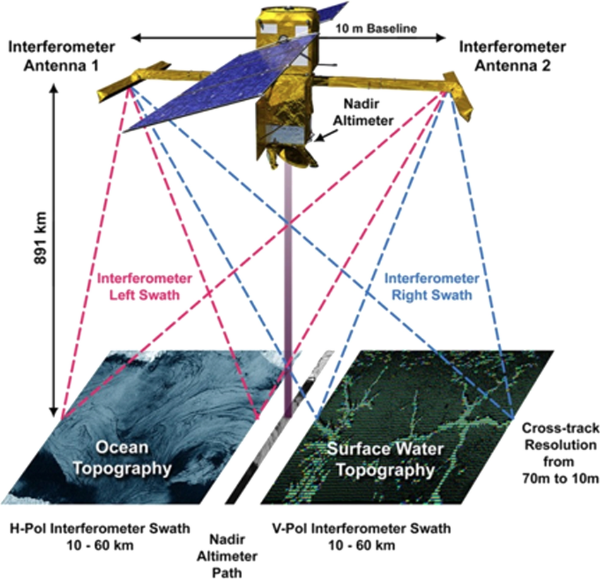

# What is SWOT?
#### Surface Water and Ocean Topography satellite

- Launched on December 16, 2022 aboard a SpaceXFalcon 9 rocket
- Led by NASA (U.S.A) and SNES (France) with contributions from Canada and UK Space Agencies
- Orbits:
  - at 891km altitude
  - at 78° inclination
  - every 21 days
- Mission lifetime of 3.5 years

```{r  echo=FALSE, out.width='60%'}
knitr::include_graphics("images/satellite.jpg")
```

---

# What is SWOT hoping to achieve?

This satellite is focused on creating a better understanding of the world's oceans and terrestrial surface waters by making the **first global survey of Earth's surface water** elevations for ocean's, rivers, lakes and wetlands

This will allow for:
- observation of small-scale **ocean currents and eddies**
- tracking regional **sea level changes**
- monitoring **river flow rates** and **lake volume changes**

---

# Where does the **KaRIn sensor** fit in?
### Ka-Band Radar Interferometer is the primary instrument on SWOT

Traditional radar altimeters measure water height only directly beneath the satellite, limiting spatial coverage. 

KaRIn overcomes this by using two antennas seperated by 10m to observe a wide swath (about 120km) on either side of the satellite's ground track. 

The sensor operates in two modes:
- High-resolution over land (rivers, lakes)
- Lower-resolution over oceans


```{r  echo=FALSE, out.width='60%'}

```

---

# Land applications

- Floods
  - Flood dynamics (rise and fall of water during flood event) can be studied
  - Mitigation and preparation
- Drought
  - Potential for development of predictive capabilities
- Reservoirs
  - Information about hanges to reservoir storage can be more widely accessible, allowing for downstream comminities to model future flow dynamics within their borders

---

# Use in study of 2024 southern Brazil flood
- SWOT satellite observations of water surface elevation and derived water slopes were used to study flood dynamics
- Researchers showed that flood was worsened by:
  1. A dramatic increase in **water slopes** (which were up to 21 times higher than in stable conditions)
  2. **Wind forcing** that raised water levels in a nearby Lagoon by up to 40cm
- These findings highlight the need to consider new flood intensifiers (water slope and wind forcing) in risk management (such as emergency warnings)
  
https://swot.jpl.nasa.gov/news/167/cutting-edge-satellite-tracks-lake-water-levels-in-ohio-river-basin/

---

# Ocean applications 

- Coastal zone management
  - Storm surge modelling
  - Sediment transport
  - Water quality issues
- Climate
  - Study the role of the ocean in regulating climate changes

---

# Implications


