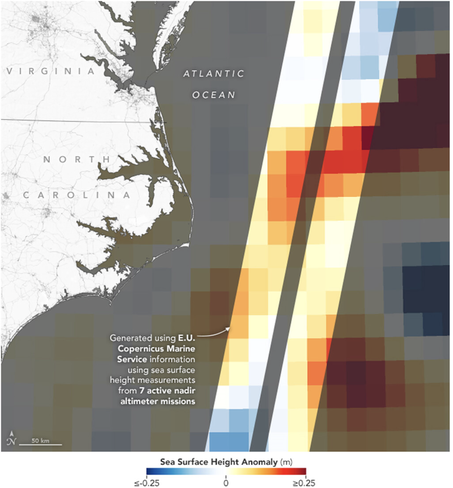
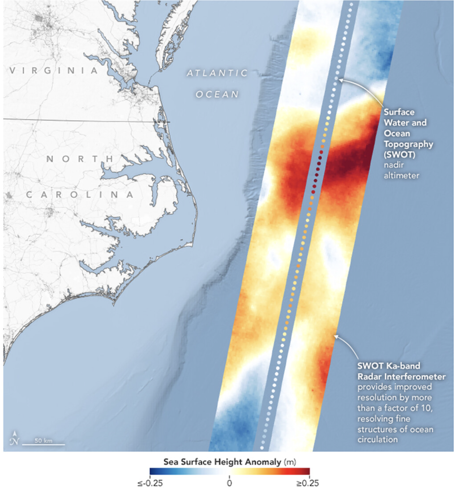
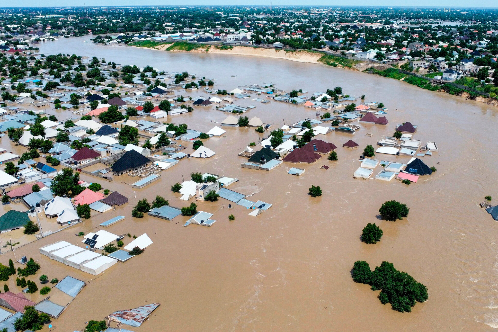
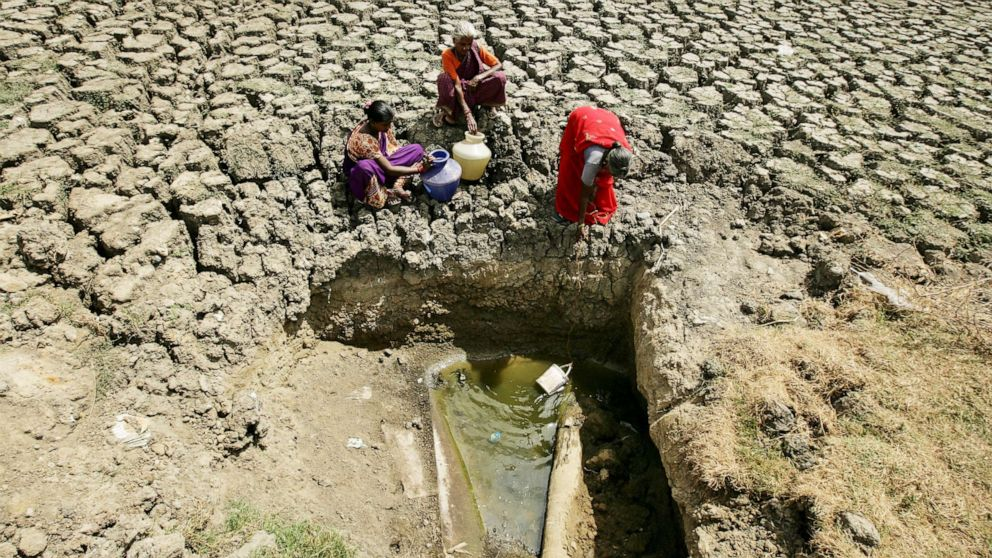
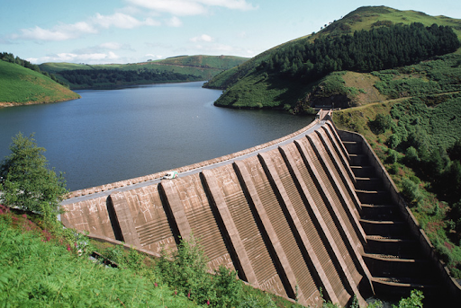
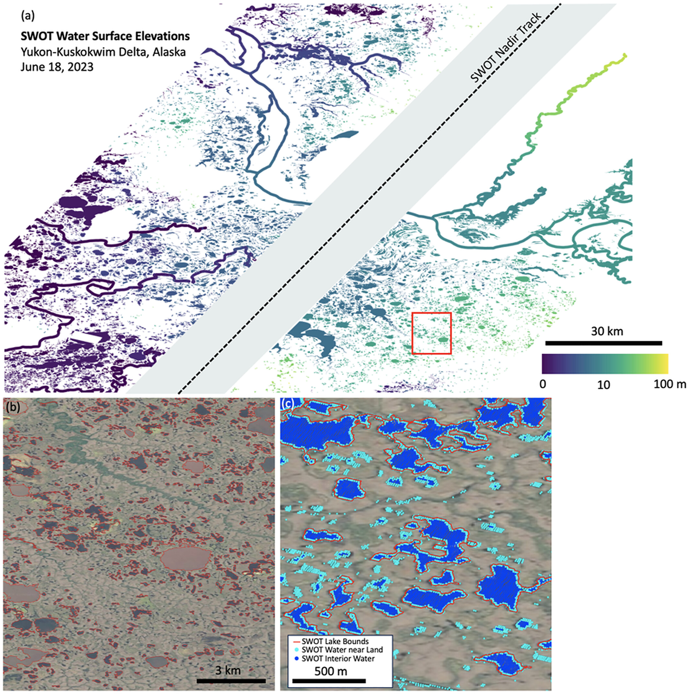
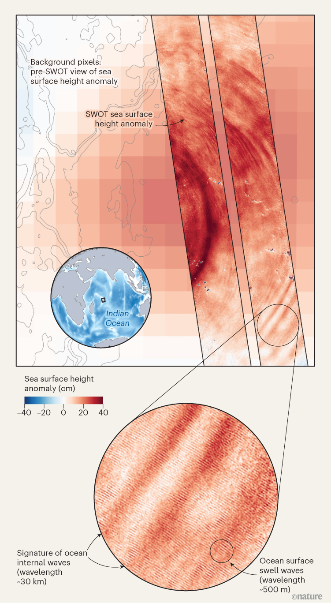

# What is SWOT?

**The Surface Water and Ocean Topography Satellite**
- Launched on December 16, 2022 aboard a SpaceXFalcon 9 rocket
- Led by NASA (U.S.A) and SNES (France) with contributions from Canada and UK Space Agencies
- Orbits:
  -  every 21 days
  - at 891km altitude
  - at 78° inclination
- Mission lifetime of 3.5 years

---
class: center, middle

# Main goal:

## Making the first global survey of Earth's surface water elevations for ocean's, rivers, lakes and wetlands


```{r  echo=FALSE, out.width='80%'}
knitr::include_graphics("images/karin_animation.gif")
```

---

# Where does the **KaRIn sensor** fit in?

### Ka-Band Radar Interferometer is the primary instrument on SWOT

.pull-left[
Traditional radar altimeters measure water height only directly beneath the satellite, limiting spatial coverage. 

KaRIn overcomes this by using two antennas separated by 10m to observe a wide swath (about 120km) on either side of the satellite's ground track. 

The sensor operates in two modes:
- High-resolution over land (rivers, lakes)
- Lower-resolution over oceans
]

.pull-right[
```{r echo=FALSE, out.width='100%'}
knitr::include_graphics("images/sensor.png")
```
]

---
# How much of an improvement is it?
<div style="margin-top:-10px;"></div>
.pull-left[

**7 x nadir altimeter missions:**

```{r echo=FALSE, out.width='100%'}

```
]

.pull-right[

**1 x SWOT mission:**

```{r echo=FALSE, out.width='100%'}

```
]

          
SWOT provides improved resolution by more than a factor of 10!
---


.pull-left[

# Land applications

- Floods
  - Flood dynamics (rise and fall of water during flood event) can be studied
  - Mitigation and preparation
  
  

- Drought
  - Potential for development of predictive capabilities <br>
  
- Reservoirs
  - Information about changes to reservoir storage can be more widely accessible, allowing for downstream communities to model future flow dynamics within their borders <br>
  
]
  
.pull-right[
```{r echo=FALSE, out.width='80%'}

```

```{r echo=FALSE, out.width='80%'}

```

```{r echo=FALSE, out.width='80%'}

```
]

---

## Example: Small-Scale Lake & River Monitoring
<div style="display: flex; width: 100%;">

<div style="width: 70%; padding-right: 1em;">
<!-- Left content here -->
```{r echo=FALSE, out.width='800%'}

```

</div>

<div style="width: 30%;"> 
<b>Lake observations:</b> SWOT recorded surface water elevations for several thousand lakes in the Yukon River Delta region, including many <strong>smaller than one hectare</strong> (100m x 100m).

<br>
<br>

<b>River Observations:</b> SWOT also successfully detected river slopes across the mainstem of the Yukon River, even at extremely shallow grades of <strong>less than 10 cm/km</strong>.
</div>

</div>


---
.pull-left[

# Ocean applications 


- Submesoscale processes
  - Study of small-scale ocean eddies & fronts
  - This is important for understanding the role of the ocean in capturing atmospheric heat and carbon

- Coastal zone management
  - Storm surge modelling & sea level rise
  - Sediment transport & water quality

- Tracking global ocean circulation 
]

.pull-right[

```{r  echo=FALSE, out.width='90%'}

```
]
---

# Reflections

Shows the importance of satellites with a more narrow application - allows for more detailed and targeted studies

---

# References

https://agupubs.onlinelibrary.wiley.com/doi/10.1029/2023GL107652
https://swot.jpl.nasa.gov/


---


